# EFDoctor

[](https://github.com/vuglll/EFDoctor/actions/workflows/ci.yml)
[](https://www.nuget.org/packages/EFDoctor)
[](LICENSE)

**Find the EF Core performance and correctness problems that survive code review.**

EFDoctor is a .NET tool that reads your solution with Roslyn and reports EF Core anti-patterns: `SaveChanges` inside a loop, synchronous database calls in async code, unbounded `ToList`, cartesian `Include` chains, raw SQL built from strings, and more. Each finding comes with the evidence that matched, the likely impact, and a fix. It runs locally, and nothing leaves your machine.



<sub>Real output of `efdoctor` 0.2.0 on [Microsoft's eShop](https://github.com/dotnet/eShop) at commit `b4a4087`, trimmed to two of its 15 findings. Paths are shown relative to the checkout.</sub>

> **Project status:** 0.x. EFD001 through EFD006, EFD009 through EFD014, EFD017 through EFD023, EFD025, EFD027, and EFD029 ship in the `efdoctor` tool. Rules, options, and output may still change before 1.0; see the [roadmap](docs/roadmap.md).

## Quick start

You need the .NET 10 runtime or later, and a solution that's already restored or built.

```bash
dotnet tool install --global EFDoctor
efdoctor analyze path/to/App.sln
```

Use `--format json` for automation. The exit code is `0` for no findings, `1` for findings, and `2` when the target can't be analyzed. The [usage guide](docs/usage.md) covers every option, JSON output, and local-tool installs.

## What it finds in real code

EFDoctor is validated against open-source EF Core applications. The two findings in the demo are real problems in Microsoft's eShop. Here is the second one, in the integration-event handler `OrderStatusChangedToAwaitingValidationIntegrationEventHandler`:

```csharp
foreach (var orderStockItem in @event.OrderStockItems)
{
    var catalogItem = catalogContext.CatalogItems.Find(orderStockItem.ProductId); // EFD010
    ...
}
```

The handler is `async`, but `Find` is synchronous. Every item in the order blocks a thread-pool thread for a full database round trip. The fix EFDoctor suggests:

```csharp
var catalogItem = await catalogContext.CatalogItems.FindAsync(orderStockItem.ProductId);
```

The same corpus turned up synchronous `Count()` calls on queries inside async maintenance tasks in [Jellyfin](https://github.com/jellyfin/jellyfin), and a synchronous `SingleOrDefault` in eShop's `DeleteItemById` endpoint.

Precision matters more than rule count, so every finding on the corpus gets a verdict. Across eShop, Jellyfin, Bitwarden, Smartstore, OpenIddict, and Ardalis's Clean Architecture template, 114 findings are triaged so far, with **no false positives**. Many of them are correct but acceptable in context, and each rule's documentation names those cases. The rest, mostly EFD005, are still being triaged. See the [validation corpus and results](validation/).

## Rules

| Rule | Finding | Confidence |
|---|---|---|
| **EFD001** | `SaveChanges` or `SaveChangesAsync` executed inside a loop | High |
| **EFD002** | `Count` or `CountAsync` used only to test existence instead of `Any` or `AnyAsync` | High |
| **EFD003** | Foreign key without a covering index in a SQL Server or PostgreSQL model snapshot | High |
| **EFD004** | Query materialized before filtering, projection, ordering, or paging that could run in SQL | High |
| **EFD005** | `ToList` or `ToListAsync` on a query with no recognized row bound | High / Medium / Advisory |
| **EFD006** | Multiple sibling collection `Include` paths that may cause a cartesian explosion | Medium |
| **EFD009** | `ToLower()` or `ToUpper()` on a column in a predicate, which prevents an index seek | Medium |
| **EFD010** | Synchronous EF Core database call (`ToList`, `Count`, `SaveChanges`, `Find`, …) inside an `async` method | Medium |
| **EFD011** | `.Result`, `.Wait()`, or `.GetAwaiter().GetResult()` blocking on an EF Core async operation | High |
| **EFD012** | SQL built by interpolation or concatenation passed to `FromSqlRaw` or `ExecuteSqlRaw` | High |
| **EFD013** | Load, loop, and save pattern that could be `ExecuteUpdate` or `ExecuteDelete` | Medium |
| **EFD014** | `Skip` pagination with no preceding `OrderBy`, so pages are non-deterministic | High |
| **EFD017** | `Include` ignored by a later `Select` that projects only non-entity values | High |
| **EFD018** | EF Core async operation whose task is discarded instead of awaited | High |
| **EFD019** | Query materialized and immediately reduced, such as `ToList().First()` | High |
| **EFD020** | `IQueryable` local enumerated more than once, re-running the query each time | Medium |
| **EFD021** | `DbContext` held in a `static` field, which isn't thread-safe | High |
| **EFD022** | `StringComparison` overload in a query predicate, which EF Core can't translate and throws at runtime | High |
| **EFD023** | `Contains`, `EndsWith`, or a leading-wildcard `Like` on a column, which can't seek an index | Advisory |
| **EFD025** | `Include` path that duplicates, or is covered by, another `Include` in the same query | High |
| **EFD027** | Two EF Core operations running at once on the same `DbContext`, which throws at run time | High |
| **EFD029** | Second `OrderBy` that discards an earlier ordering where `ThenBy` was meant | High |

Each rule has a reference page in [`docs/rules/`](docs/rules/) with what triggers it, what deliberately doesn't, the remediation, and how to suppress it. [Rule boundaries](docs/rules/README.md) summarizes how far each rule follows your code.

## Documentation

- [Usage](docs/usage.md): commands, options, exit codes, JSON output, installation, and the trust boundary
- [Suppressing findings](docs/suppression.md): pragmas, `.editorconfig`, and `SuppressMessage`
- [Rules](docs/rules/): one page per rule, and the [rule boundaries](docs/rules/README.md)
- [Roadmap](docs/roadmap.md): candidate rules, priorities, and the quality bar every rule meets
- [Development](docs/development.md): building, testing, and how the repository is organized
- [Changelog](CHANGELOG.md)

## Principles

- **Evidence over guesses:** every finding explains what matched, and where.
- **Precision over rule count:** a few trusted rules beat dozens of noisy warnings.
- **Context-aware guidance:** remediation names the legitimate exceptions.
- **Local first:** no telemetry, no network calls, no source upload.

## Contributing

Bug reports, especially false positives, and pull requests are welcome. Start with [`CONTRIBUTING.md`](CONTRIBUTING.md). To report a vulnerability, see [`SECURITY.md`](SECURITY.md).

## License

EFDoctor is licensed under the [Apache License, Version 2.0](LICENSE). Copyright 2026 Nemanja Markovic; see [`NOTICE`](NOTICE).
